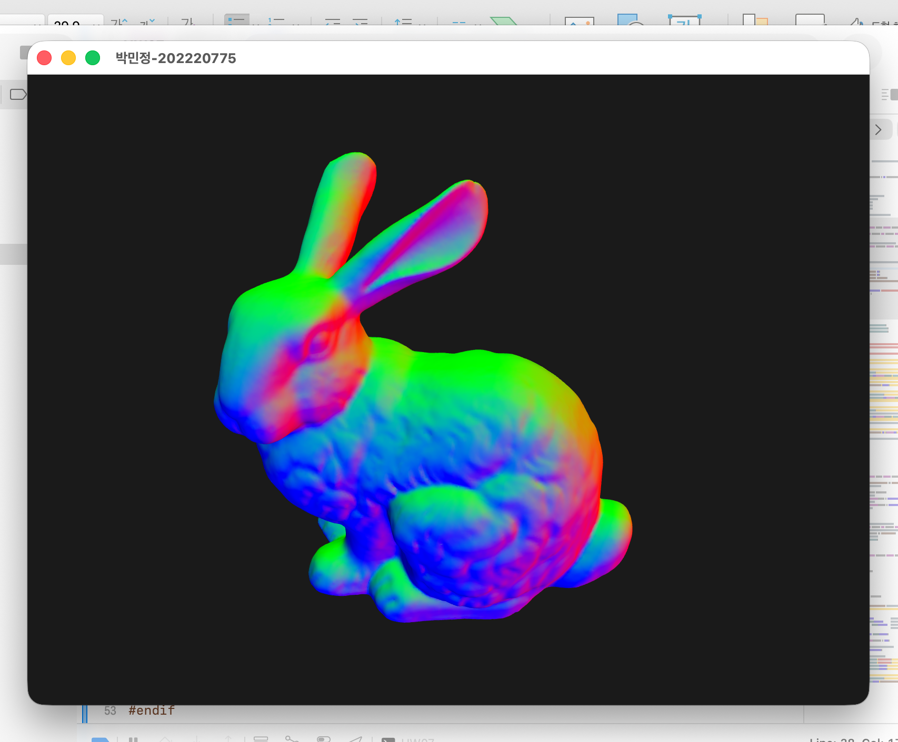
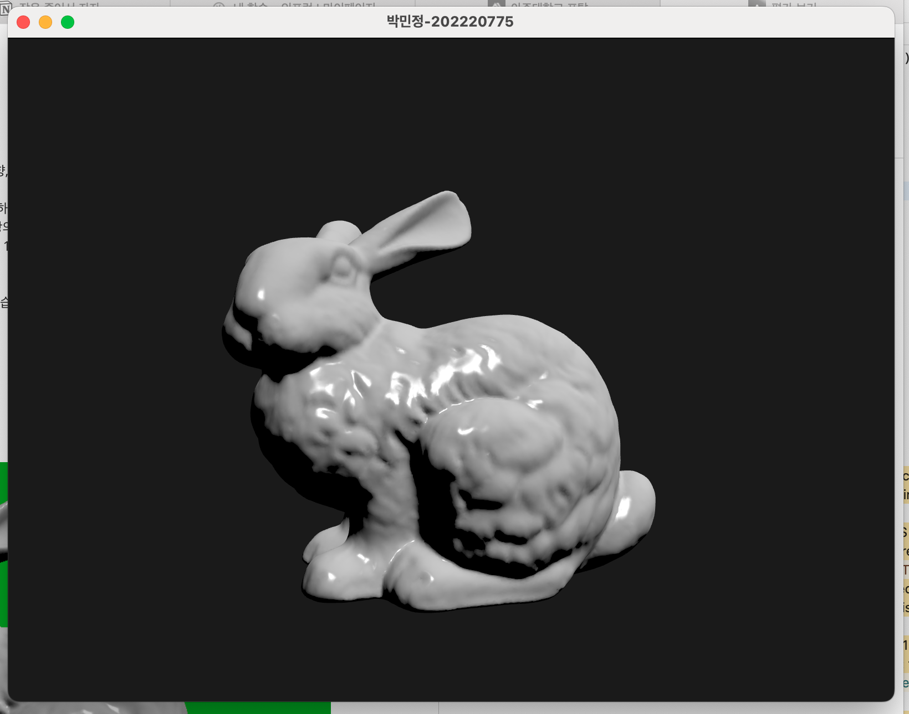
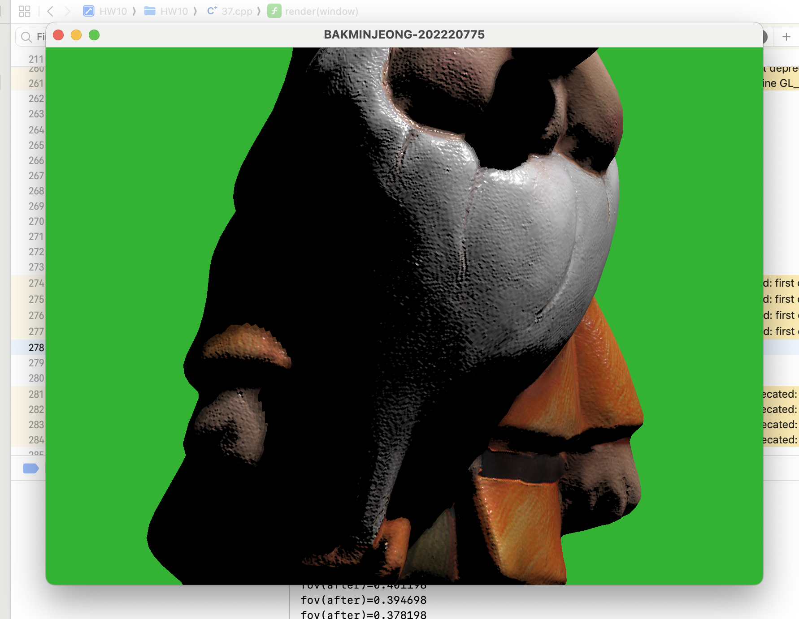
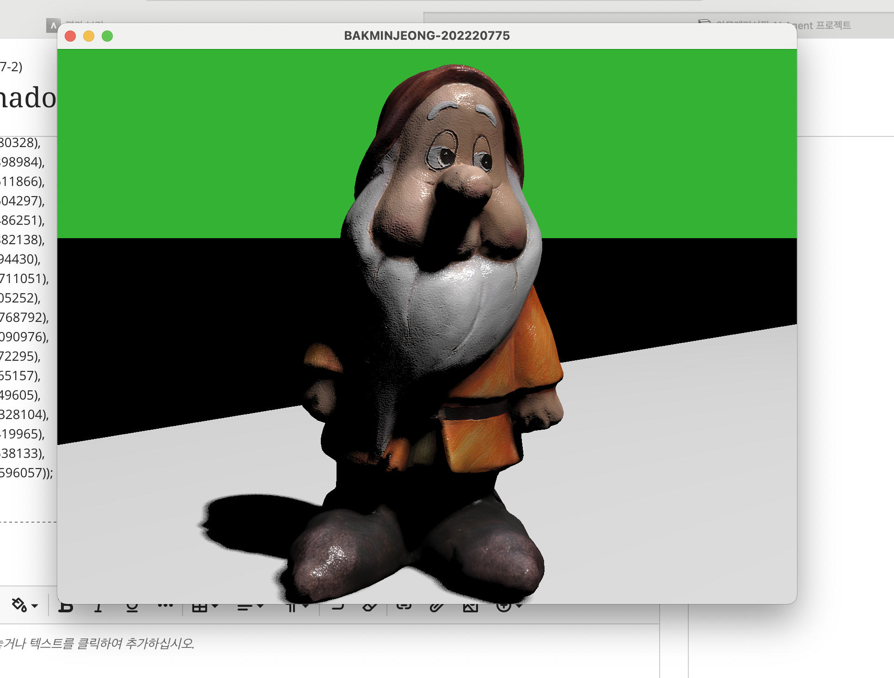

# 🎨 Computer Graphics — OpenGL Practice Collection  
**Ajou University · Computer Graphics (2025 Fall)**

OpenGL 기반 **3D 렌더링 파이프라인을 단계적으로 구현한 실습 프로젝트 모음**입니다.  
행렬 변환과 카메라 제어부터 시작해,  
조명·텍스처·쉐도우 매핑, **Poisson Disk 기반 Soft Shadow**까지 구현했습니다.

---

## 🧠 Core Concepts

- Model–View–Projection Pipeline
- Vertex / Fragment Shader (GLSL)
- Lighting (Lambert, Phong)
- Texture & Bump Mapping
- Depth Buffer & Shadow Mapping
- Gamma Correction
- Soft Shadow (Poisson Disk Sampling)

---

## 🛠️ Tech Stack

| Category | Stack |
|--------|------|
| Language | C++ |
| Graphics API | OpenGL (Core Profile) |
| Math | GLM |
| Shader | GLSL |
| Window | GLFW |
| Model | J3A (bunny, dwarf) |

---

## 📁 Project Structure

> 과제는 **누적 구현 방식**으로 진행되었습니다.
```
HW01        # Graphics 이론 조사
week0203   # MVP 행렬 & 좌표 변환
HW0405     # OpenGL 기본 렌더링
HW06       # Orbit Camera
HW07       # Lighting & 3D Model
HW09       # Z-buffer & Hidden Surface
HW10       # Gamma Correction
HW11       # Texture & Specular
HW12       # Bump Mapping
HW13       # Shadow Mapping
HW14       # Soft Shadow (Final)
```
---

## ✨ Key Highlights

- **Shader 기반 렌더링 파이프라인 직접 구현**
- `glm::lookAt`, `glm::perspective` 기반 카메라 제어
- Texture & Bump Mapping (TBN Matrix)
- Offscreen FBO를 이용한 Shadow Map 생성
- **Poisson Disk + Randomized Sampling Soft Shadow 구현**

---

## 🖼️ Result Preview

  

*Depth Buffer & Hidden Surface Removal*

  

*Phong Lighting & Specular Highlight*

  

*Basic Shadow Mapping*

  

*Soft Shadow (Poisson Disk Sampling)*

---

## 📌 Notes
- OpenGL 4.1 Core Profile (macOS)
- GLSL Shader 직접 작성
- Xcode 기반 개발